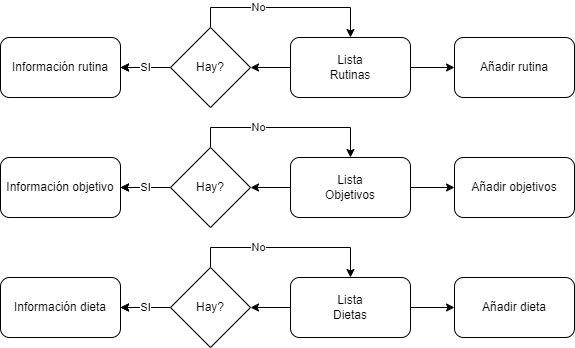

# Diseño 

Las funcionalidades claves del proyecto son las de guardado en base de datos de las rutinas , objetivos y dietas implementando Room.

## Navegación 

Se adjuntará un esquema de mockup’s de las diferentes pantallas, la navegación y los datos intercambiados entre ellas
